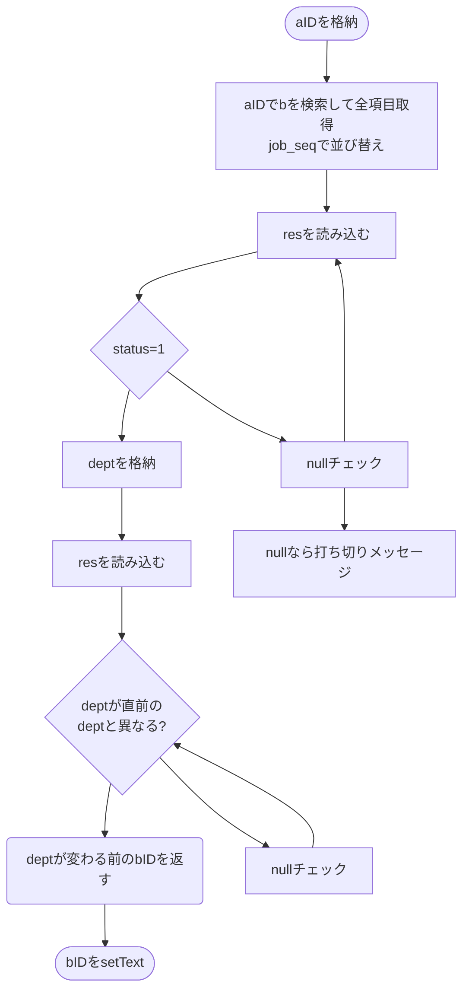

```mermaid
flowchart TB
  node_1(["aIDを格納"])
  node_4["aIDでbを検索して全項目取得\njob_seqで並び替え"]
  node_2["resを読み込む"]
  node_3{"status=1"}
  node_5["deptを格納"]
  node_6["nullチェック"]
  node_7["resを読み込む"]
  node_8{"deptが直前の\ndeptと異なる?"}
  node_9["nullなら打ち切りメッセージ"]
  node_10("deptが変わる前のbIDを返す")
  node_11["nullチェック"]
  node_12(["bIDをsetText"])
  node_1 --> node_4
  node_4 --> node_2
  node_2 --> node_3
  node_3 --> node_5
  node_3 --> node_6
  node_6 --> node_2
  node_5 --> node_7
  node_7 --> node_8
  node_6 --> node_9
  node_8 --> node_10
  node_8 --> node_11
  node_11 --> node_8
  node_10 --> node_12
```

